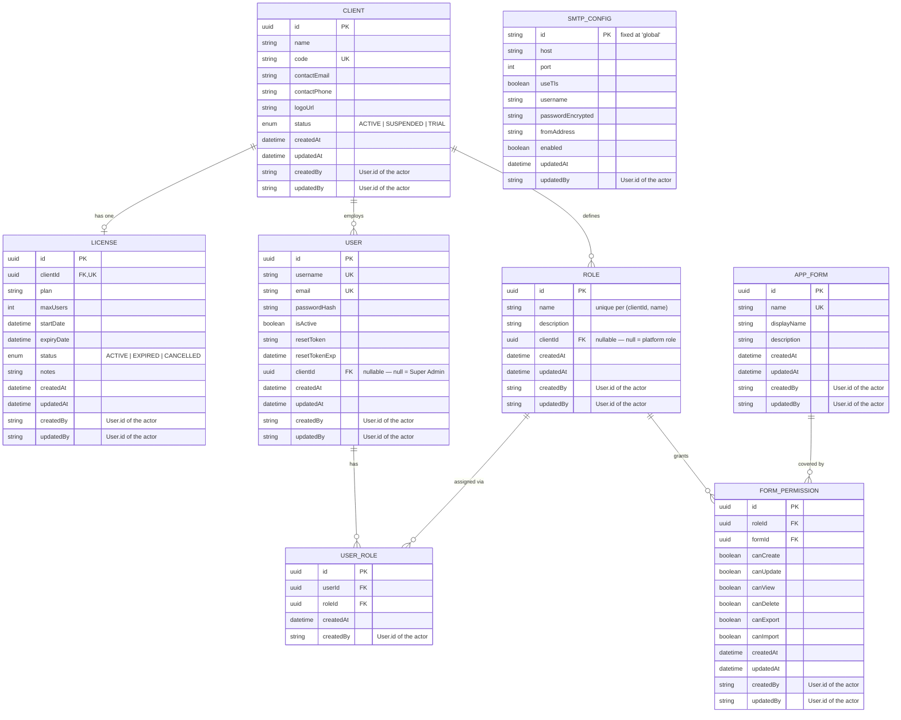

# Database Design

This document describes the data model behind the Enterprise App (multi-tenant
RBAC platform). The schema is defined in
[`backend/prisma/schema.prisma`](../backend/prisma/schema.prisma) using
Prisma ORM against PostgreSQL; this document explains the *why* behind that
schema, not just the *what*.

## 1. Overview

The system is a **multi-tenant SaaS**: a single database serves many customer
organizations ("Clients"), each with its own users, roles, and permission
grants, isolated from one another. A separate **platform layer** (Super
Admin) sits above all tenants to provision Clients and manage their
Licenses.

Two isolation levels exist in one shared schema:

| Level | Who | Scoped by |
|---|---|---|
| **Platform** | Super Admin | `clientId IS NULL` |
| **Tenant** | Client Admins & their users | `clientId = <client's UUID>` |

This is a **shared-schema, row-level multi-tenancy** model (not
database-per-tenant or schema-per-tenant): simplest to operate at this scale,
and every tenant-scoped table carries a `clientId` foreign key that the
application layer filters on for every query (enforced in the NestJS service
layer, e.g. `backend/src/users/users.service.ts`, `backend/src/roles/roles.service.ts`).

## 2. Entity-Relationship Diagram

`SmtpConfig` has no foreign keys — it's a platform-wide singleton, not part
of the tenant graph (see §4.8).

## 3. Tables

Every scalar column of every model is listed below (relation fields are
listed too, marked as such). "Constraints" reflects what Prisma/Postgres
enforce. Every table also carries `createdBy`/`updatedBy` audit columns —
see §4.10 for how those are populated.

### 3.1 `Client`
A customer organization ("tenant"). The root of everything tenant-scoped.

| Field | Type | Constraints | Default | Description |
|---|---|---|---|---|
| `id` | String (uuid) | PK | `uuid()` | Primary key. |
| `name` | String | required | — | Organization display name. Editable by both Super Admin and the tenant's own Admin (`PUT /api/my-client`). |
| `code` | String | **UNIQUE**, required | — | Stable business identifier (e.g. `ACME`). Super-Admin-only — a tenant Admin cannot change it (enforced by a narrower DTO, `UpdateMyClientDto`, that simply has no `code` field, combined with the global `forbidNonWhitelisted` validation pipe rejecting any extra field). |
| `contactEmail` | String? | optional | `null` | Primary contact email. Editable by the tenant's own Admin. |
| `contactPhone` | String? | optional | `null` | Primary contact phone. Editable by the tenant's own Admin. |
| `logoUrl` | String? | optional | `null` | Relative path under `/uploads/logos/`, set via a multipart upload endpoint (`POST /api/super-admin/clients/:id/logo` for Super Admin, `POST /api/my-client/logo` for a Client Admin editing their own org). |
| `status` | `ClientStatus` (enum) | required | `ACTIVE` | `ACTIVE` \| `SUSPENDED` \| `TRIAL`. **Super-Admin-only.** Checked at login time — a `SUSPENDED` client's users cannot sign in (`auth.service.ts login()`). |
| `createdAt` | DateTime | required | `now()` | Row creation timestamp. |
| `updatedAt` | DateTime | required, auto | Prisma `@updatedAt` | Rewritten on every update automatically. |
| `createdBy` | String? | optional | `null` | `User.id` of whoever created this row (always the acting Super Admin — see §4.10). `null` for seed-bootstrapped rows. |
| `updatedBy` | String? | optional | `null` | `User.id` of whoever last modified this row — set on every update, including logo/license changes. |
| `users` | `User[]` | relation (back-ref) | — | Inverse of `User.clientId`. |
| `roles` | `Role[]` | relation (back-ref) | — | Inverse of `Role.clientId`. |
| `license` | `License?` | relation (back-ref) | — | Inverse of `License.clientId`; optional since a brand-new Client may not have a license yet. |

### 3.2 `License`
One row per `Client` (`clientId` is unique — enforced 1:1, not 1:many; a
renewal *overwrites* the existing row rather than creating history).

| Field | Type | Constraints | Default | Description |
|---|---|---|---|---|
| `id` | String (uuid) | PK | `uuid()` | Primary key. |
| `clientId` | String | FK → `Client.id`, **UNIQUE** | — | Enforces the 1:1 relationship. `onDelete: Cascade` — deleting a `Client` removes its license. |
| `plan` | String | required | — | Free-text plan name (e.g. "Enterprise"), not a fixed enum — plans are a business/pricing concept, not a technical constraint. |
| `maxUsers` | Int | required | — | Seat limit. Enforced on user creation (`users.service.ts create()`): rejects with `BadRequestException` once `count(User where clientId=...) >= maxUsers`. |
| `startDate` | DateTime | required | — | License start date. |
| `expiryDate` | DateTime | required | — | License end date. Checked at every login and on user creation — an expired license blocks both. |
| `status` | `LicenseStatus` (enum) | required | `ACTIVE` | `ACTIVE` \| `EXPIRED` \| `CANCELLED`. Independent of the date fields — Super Admin can hard-cancel a license before its natural expiry. |
| `notes` | String? | optional | `null` | Free-text notes for Super Admin's own reference. |
| `createdAt` | DateTime | required | `now()` | Row creation timestamp. |
| `updatedAt` | DateTime | required, auto | Prisma `@updatedAt` | Rewritten on every update automatically (including renewals). |
| `createdBy` | String? | optional | `null` | `User.id` of the Super Admin who first set up this license. |
| `updatedBy` | String? | optional | `null` | `User.id` of the Super Admin who last renewed/changed it. |
| `client` | `Client` | relation | — | Owning client. |

### 3.3 `User`
An individual login. Shared table for **both** platform staff and tenant
users — the discriminator is `clientId`.

| Field | Type | Constraints | Default | Description |
|---|---|---|---|---|
| `id` | String (uuid) | PK | `uuid()` | Primary key. |
| `username` | String | **UNIQUE (global)** | — | Login name, unique across the *whole platform*, not per-client — see §4.9. |
| `email` | String | **UNIQUE (global)** | — | Also globally unique. Used for login (interchangeably with `username`) and password-reset delivery. |
| `passwordHash` | String | required | — | bcrypt hash, cost factor 12. Plaintext is never stored. |
| `isActive` | Boolean | required | `true` | Soft on/off switch — `false` blocks login but keeps the row. Distinct from deletion. |
| `resetToken` | String? | optional | `null` | Forgot-password flow: a random 32-byte hex string. Cleared on successful reset. |
| `resetTokenExp` | DateTime? | optional | `null` | Expiry for `resetToken` — set to 1 hour from issuance. |
| `clientId` | String? | FK → `Client.id`, nullable | `null` | **Nullable.** `NULL` = a platform-level user (Super Admin). Non-null = a tenant user. This single nullable column is what separates "platform" from "tenant" throughout the app — see §4.1. `onDelete: Cascade` when non-null. |
| `createdAt` | DateTime | required | `now()` | Row creation timestamp. |
| `updatedAt` | DateTime | required, auto | Prisma `@updatedAt` | Rewritten on every update automatically. |
| `createdBy` | String? | optional | `null` | `User.id` of whoever created this user (a Super Admin provisioning a client, or a Client Admin adding a teammate). `null` for seed-bootstrapped rows. |
| `updatedBy` | String? | optional | `null` | `User.id` of whoever last modified this row — including the user themself via `POST /api/auth/change-password` (see §4.11). |
| `client` | `Client?` | relation | — | The owning tenant, or absent for platform users. |
| `userRoles` | `UserRole[]` | relation (back-ref) | — | This user's role assignments. |

### 3.4 `Role`
A named permission bundle, scoped to one `Client` (or platform-wide if
`clientId` is null — used only for the built-in `SuperAdmin` role).

| Field | Type | Constraints | Default | Description |
|---|---|---|---|---|
| `id` | String (uuid) | PK | `uuid()` | Primary key. |
| `name` | String | **UNIQUE per `(clientId, name)`** | — | Unique **per client**, not globally — two different Clients can each have their own "Manager" role. See §4.2 for the `NULL`-handling nuance. |
| `description` | String? | optional | `null` | Free-text description shown in the Roles UI. |
| `clientId` | String? | FK → `Client.id`, nullable | `null` | Nullable for the same reason as `User.clientId` — `NULL` marks the built-in platform-level `SuperAdmin` role. `onDelete: Cascade` when non-null. |
| `createdAt` | DateTime | required | `now()` | Row creation timestamp. |
| `updatedAt` | DateTime | required, auto | Prisma `@updatedAt` | Rewritten on every update automatically. |
| `createdBy` | String? | optional | `null` | `User.id` of whoever created this role. `null` for seed-bootstrapped rows (including the platform `SuperAdmin` role). |
| `updatedBy` | String? | optional | `null` | `User.id` of whoever last edited this role's name/description. |
| `client` | `Client?` | relation | — | The owning tenant, or absent for the platform `SuperAdmin` role. |
| `userRoles` | `UserRole[]` | relation (back-ref) | — | Users holding this role. |
| `formPermissions` | `FormPermission[]` | relation (back-ref) | — | This role's per-form permission grants. |

**Special case — the `Admin` role**: every Client gets an auto-provisioned
role literally named `"Admin"` (created the moment a Client is created with
an initial admin user, or the first time Super Admin adds a user to a
client with none — see `clients.service.ts createAdminUserForClient()`).
This role is protected in application code (`roles.service.ts`):
- Cannot be deleted (`remove()` throws if `role.name === 'Admin'`).
- Cannot be renamed away from `"Admin"` (`update()` throws on that specific
  change) — closing the "rename then delete" loophole.

This is an **application-level invariant, not a database constraint** —
there's nothing in the schema itself preventing a row named `Admin` from
being deleted; the guard lives in the service layer.

### 3.5 `UserRole`
Pure join table for the `User` ↔ `Role` many-to-many relationship.

| Field | Type | Constraints | Default | Description |
|---|---|---|---|---|
| `id` | String (uuid) | PK | `uuid()` | Primary key. |
| `userId` | String | FK → `User.id` | — | `onDelete: Cascade`. |
| `roleId` | String | FK → `Role.id` | — | `onDelete: Cascade`. |
| `createdAt` | DateTime | required | `now()` | When this role was assigned to this user. |
| `createdBy` | String? | optional | `null` | `User.id` of whoever performed the assignment. No `updatedBy`/`updatedAt` — rows are only ever created or deleted, never edited in place (see the replace-all note below). |
| `user` | `User` | relation | — | The assigned user. |
| `role` | `Role` | relation | — | The assigned role. |

`@@unique([userId, roleId])` prevents duplicate assignments of the same role
to the same user.

Role assignment is **replace-all**, not incremental: `POST /api/users/:id/roles`
deletes all of a user's existing `UserRole` rows and recreates them from the
submitted list in one call (see `users.service.ts assignRoles()`).

### 3.6 `AppForm`
The catalog of protectable "modules" in the application (e.g. `Users`,
`Roles`, `Invoices`). **Global, not tenant-scoped** — there is deliberately
no `clientId` here.

| Field | Type | Constraints | Default | Description |
|---|---|---|---|---|
| `id` | String (uuid) | PK | `uuid()` | Primary key. |
| `name` | String | **UNIQUE (global)** | — | System/technical name (e.g. `Invoices`), referenced by permission checks. |
| `displayName` | String | required | — | Human-readable label shown in the UI. |
| `description` | String? | optional | `null` | Free-text description. |
| `createdAt` | DateTime | required | `now()` | Row creation timestamp. |
| `updatedAt` | DateTime | required, auto | Prisma `@updatedAt` | Rewritten on every update automatically. |
| `createdBy` | String? | optional | `null` | `User.id` of the Super Admin who registered this form. `null` for seed-bootstrapped rows. |
| `updatedBy` | String? | optional | `null` | `User.id` of the Super Admin who last edited it. |
| `formPermissions` | `FormPermission[]` | relation (back-ref) | — | Every role's grant against this form. |

All Clients share the same module catalog; only the *permissions* on top of
it (`FormPermission`) are per-tenant. Managed exclusively by Super Admin
(`FormsController` is `@Roles('SuperAdmin')`-gated).

### 3.7 `FormPermission`
The permission grant: what a given `Role` may do on a given `AppForm`.

| Field | Type | Constraints | Default | Description |
|---|---|---|---|---|
| `id` | String (uuid) | PK | `uuid()` | Primary key. |
| `roleId` | String | FK → `Role.id` | — | `onDelete: Cascade`. |
| `formId` | String | FK → `AppForm.id` | — | `onDelete: Cascade`. |
| `canCreate` | Boolean | required | `false` | Create new records. |
| `canUpdate` | Boolean | required | `false` | Edit existing records. |
| `canView` | Boolean | required | `false` | View/read records. |
| `canDelete` | Boolean | required | `false` | Delete records. |
| `canExport` | Boolean | required | `false` | Export data out of the system. |
| `canImport` | Boolean | required | `false` | Import data into the system. |
| `createdAt` | DateTime | required | `now()` | Row creation timestamp. |
| `updatedAt` | DateTime | required, auto | Prisma `@updatedAt` | Rewritten every time the grant is toggled. |
| `createdBy` | String? | optional | `null` | `User.id` of whoever first granted any permission on this (role, form) pair. |
| `updatedBy` | String? | optional | `null` | `User.id` of whoever last toggled a checkbox on this grant. |
| `role` | `Role` | relation | — | The role this grant applies to. |
| `form` | `AppForm` | relation | — | The form/module this grant applies to. |

`@@unique([roleId, formId])` — one row per (role, form) pair, upserted in
place rather than versioned. (Earlier revision had `canRead`/`canWrite`
instead of `canView`/`canUpdate` and no export/import flags — renamed and
extended to the current set.)

A user's effective permissions are the **OR** across every role they hold
(`auth.service.ts getMyPermissions()`) — if *any* assigned role grants an
action on a form, the user has it. There is no explicit-deny; permissions
are purely additive.

### 3.8 `SmtpConfig`
A **singleton** row holding the platform's one outbound-mail configuration,
managed by Super Admin (`GET/PUT /api/super-admin/smtp-config`).

| Field | Type | Constraints | Default | Description |
|---|---|---|---|---|
| `id` | String | PK, fixed value | `"global"` | Hardcoded literal, **not** a generated UUID — guarantees a single row by construction (every read/write targets `id: 'global'`). |
| `host` | String? | optional | `null` | SMTP server hostname. |
| `port` | Int | required | `587` | SMTP server port. |
| `useTls` | Boolean | required | `true` | Whether to use STARTTLS. |
| `username` | String? | optional | `null` | SMTP auth username. |
| `passwordEncrypted` | String? | optional | `null` | SMTP auth password, AES-256-CBC encrypted at rest (`backend/src/lib/encryption.ts`) using an `ENCRYPTION_KEY` env var. The API never returns the plaintext or ciphertext to the client — `GET` responds with a `passwordSet: boolean` flag instead, and `PUT` only re-encrypts a new value if one was actually submitted (blank = "keep current"). |
| `fromAddress` | String? | optional | `null` | The `From:` address/display name used on outgoing mail. |
| `enabled` | Boolean | required | `false` | Kill switch independent of whether credentials are filled in, so Super Admin can configure SMTP without immediately activating it. |
| `updatedAt` | DateTime | required, auto | Prisma `@updatedAt` | Rewritten on every settings change. |
| `updatedBy` | String? | optional | `null` | `User.id` of the Super Admin who last saved these settings. No `createdBy`/`createdAt` — the singleton row is always upserted, so there's no meaningful "created" moment distinct from the first update. |

Used by `auth.service.ts forgotPassword()`: if `enabled` and fully
configured, a real reset email is sent; otherwise the API falls back to
returning the reset token directly in the response body (`devToken`) so
local development still works without mail set up.

## 4. Key design decisions

### 4.1 Nullable `clientId` as the platform/tenant switch
Rather than a separate `SuperAdmin` table or a `role: 'PLATFORM' | 'TENANT'`
column, the schema reuses `User.clientId IS NULL` and `Role.clientId IS NULL`
as the single source of truth for "this belongs to the platform, not a
tenant." Every guard in the app (`TenantGuard`, `RolesGuard`) and every
tenant-scoped Prisma query ultimately keys off this one nullable column.
Trade-off: cheap to reason about and query, but means tenant isolation is an
*application* guarantee (every service method must remember to filter by
`clientId`), not a database-enforced one (e.g. via Postgres row-level
security policies).

### 4.2 Why `Role.name` is unique per-client, not globally
`@@unique([clientId, name])` instead of `@@unique([name])`. This lets every
Client independently have a "Manager" or "Viewer" role without colliding
with another Client's role of the same name — required for the tenant model
to make sense at all. Postgres treats `NULL` as distinct from any other value
in a unique index, so multiple platform-level roles with `clientId = NULL`
technically *aren't* uniqueness-checked against each other by the database;
the seed script (`prisma/seed.ts`) avoids relying on that constraint for the
`SuperAdmin` role and uses find-or-create instead (see the comment there).

### 4.3 License as 1:1, not 1:many
A `License` is unique per `Client` (`clientId @unique`), so renewing or
changing plans **overwrites** the existing row (`upsert` in
`clients.service.ts upsertLicense()`) rather than appending a new one. This
was a deliberate simplicity trade-off over a history table — there's no
audit trail of past licenses, only the current one.

### 4.4 `AppForm` is global; everything else tenant data is not
Forms represent the *product's own* screens/modules (a fixed,
platform-curated catalog), not tenant-authored content — so unlike `User`
and `Role`, it deliberately has no `clientId`. This means every Client's
Roles are permissioned against the *same* set of forms.

### 4.5 Permissions are additive-only (no explicit deny)
`FormPermission` booleans are ORed across a user's roles with no "deny"
concept. Simpler mental model (more roles only ever grant more, never
restrict), at the cost of not being able to express "grant X except deny Y."

### 4.6 Seat limits and license expiry are enforced at write-time, not via a DB constraint
`maxUsers` and `expiryDate` are plain columns — the actual enforcement
(rejecting user creation over the seat limit, rejecting login when expired)
lives in `users.service.ts` and `auth.service.ts`, evaluated against
`Date.now()` on every relevant request. There's no scheduled job that
flips `License.status` to `EXPIRED` automatically; an expired-but-still-
`ACTIVE`-status license is caught by the `expiryDate < now` check
regardless of the `status` column.

### 4.7 Cascading deletes
Every tenant-scoped table cascades from `Client` (`onDelete: Cascade`):
deleting a `Client` deletes its `License`, `User`s, and `Role`s, which in
turn cascade to `UserRole` and `FormPermission`. Deleting a Client is a
one-call, fully-destructive operation by design — there is no soft-delete
for `Client` itself (contrast with `User.isActive`, which *is* a soft
switch).

### 4.8 Why `SmtpConfig` isn't tenant-scoped
Outbound mail is a platform-level concern (one SMTP relay for the whole
app), not something each Client configures independently — hence a
singleton row with a hardcoded `id`, rather than a `clientId` FK.

### 4.9 Why `User.username`/`email` are unique globally, not per-tenant
Unlike `Role.name`, `User.username` and `User.email` are unique across the
**whole platform** (`@unique`, not a composite `@@unique([clientId, ...])`).
Two different Clients cannot both register `admin@theirdomain.com`, or both
have a user named `admin` — a deliberate simplification, acceptable at this
app's scale, but worth calling out because it's the one place tenant
isolation is *not* fully enforced at the data layer (every other
tenant-owned entity — `Role`, and everything reachable only through a
`clientId`-scoped query — is isolated per client). A stricter design would
make these composite-unique on `(clientId, username)` the same way `Role`
is, at the cost of needing a client identifier at login time (since
`username` alone would no longer be enough to find the right row).

### 4.10 `createdBy`/`updatedBy` are plain actor-id strings, not foreign keys
Every table (except the pure-join `UserRole`, which only has `createdBy`)
carries `createdBy String?` and `updatedBy String?`, holding the acting
`User.id` — populated from `req.user.id` on every authenticated
create/update call, all the way from the controller layer (e.g.
`clients.controller.ts`, `users.controller.ts`) down through the
corresponding service method. Deliberately **not** a Prisma relation:
- A real FK would need a *named* relation on `User` for every table that
  references it twice over (once for `createdBy`, once for `updatedBy`),
  multiplied across seven models — a lot of schema noise for a field that's
  purely informational.
- These columns cross the platform/tenant boundary freely (a Super Admin,
  who has no `clientId`, routinely creates rows scoped to a `Client` they
  don't belong to) — a plain string sidesteps having to reason about that
  as a constraint.
- If the actor `User` is later deleted, the audit trail is preserved as a
  "dangling" id rather than being cascade-deleted or nulled out — the
  historical fact "this row was created by user X" outlives X's account.
- Nothing in the schema enforces that the stored value is actually a valid
  `User.id` — that's on the application layer to get right (every call site
  populates it from the authenticated JWT's `sub` claim, never from
  client-submitted input).

Rows written by `prisma/seed.ts` have `createdBy`/`updatedBy` left `null` —
there's no authenticated actor at seed time.

### 4.11 Self-service password change reuses `User.passwordHash`/`updatedBy`, no new table
`POST /api/auth/change-password` (`auth.service.ts changePassword()`) lets
any authenticated user — tenant or Super Admin — change their own password:
verifies `currentPassword` against `passwordHash` with `bcrypt.compare`,
then overwrites `passwordHash` and sets `updatedBy` to the user's own id
(the one case where `updatedBy` intentionally equals the row's own `id`).
No schema addition was needed — it's the same `passwordHash` column the
forgot-password flow already writes to, just reached through a different,
self-service entry point that requires knowing the current password rather
than an emailed reset token.

## 5. Indexes & constraints at a glance

| Table | Constraint |
|---|---|
| `Client.code` | `UNIQUE` |
| `License.clientId` | `UNIQUE` (enforces 1:1 with `Client`) |
| `User.username` | `UNIQUE` (global) |
| `User.email` | `UNIQUE` (global) |
| `Role.(clientId, name)` | `UNIQUE` composite |
| `AppForm.name` | `UNIQUE` (global) |
| `UserRole.(userId, roleId)` | `UNIQUE` composite (no duplicate assignments) |
| `FormPermission.(roleId, formId)` | `UNIQUE` composite (one grant row per role/form pair) |

All primary keys are `uuid` (Prisma `@default(uuid())`) except
`SmtpConfig.id`, which is the fixed string `"global"`.

## 6. Where this is enforced in code

| Concern | File |
|---|---|
| Schema source of truth | `backend/prisma/schema.prisma` |
| Tenant scoping guard | `backend/src/auth/tenant.guard.ts` |
| Role-based guard (`SuperAdmin`, `Admin`) | `backend/src/auth/roles.guard.ts` |
| Login-time client/license checks | `backend/src/auth/auth.service.ts` (`login()`) |
| Seat-limit enforcement | `backend/src/users/users.service.ts` (`create()`) |
| Admin-role delete/rename protection | `backend/src/roles/roles.service.ts` |
| Permission merge logic (OR across roles) | `backend/src/auth/auth.service.ts` (`getMyPermissions()`) |
| SMTP password encryption | `backend/src/lib/encryption.ts` |
| `createdBy`/`updatedBy` population | Every mutating controller method, e.g. `clients.controller.ts`, `users.controller.ts`, `roles.controller.ts` — each passes `req.user.id` into its service call |
| Self-service password change | `backend/src/auth/auth.service.ts` (`changePassword()`), `backend/src/auth/auth.controller.ts` (`POST /api/auth/change-password`) |
| Seed data / bootstrap | `backend/prisma/seed.ts` |
